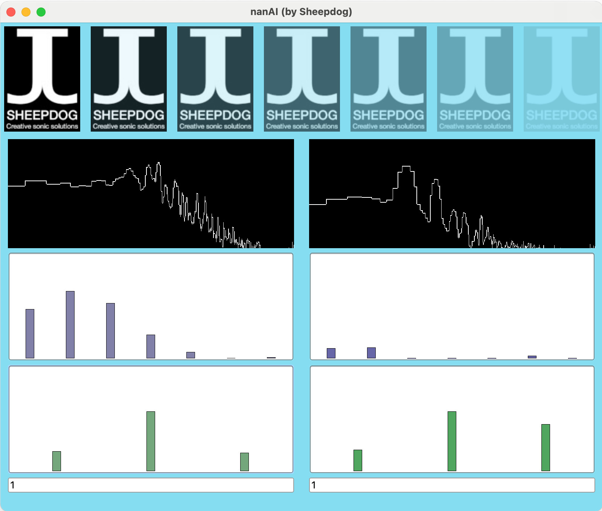

# nanAI

*nanAI* is a collaborative piece that ains to establish a dialogue between a live performer and and Artificial Intelligence model. The code here presented is a specific part of the whole piece consisting on a unsupervised Machine Learning model creation based on a set of (manually) selected audio descriptors implemented in Supercollider for Realtime performance.  

## Requirements

- SuperCollider 3.13 or higher
- Korg nanoKONTROL2 midi interface
- A folder with some stereo audio files (for playback use)
- A soundcard with some audio inputs (for realtime use)

## Use

- Run `korgNANOKONTROL2toOSC.scd`
- Open `nanAI_config` for configuration
  - `~n_inputs`: Number of input channels. Each channel performs an independent analysis
  - `~n_outputs`: Number of output channels. Only for monitoring input, with creative panning
  - `~n_dims`: Number of computed descriptors (manually selected according to nanAI_synths)
  - `~kme_k`: number of clusters
  - `~audio_path`: Path to audio files, in case of recorded input.
  - `~result_osc_out`: IP address for output values (manually selected) 
- Run `nanAI_play.scd` to sequentially run all scripts:
  - `nanAI.config.scd`
  - `nanAI.synths.scd`
  - `nanAI.oscControl.scd`
  - `nanAI.gui.scd`
  - `nanAI.oscSend.scd`
- Play with Korg midi controller:
  - Play:  Play all files in ~audio_path
  - Rec:   Listens all channels in ~n_inputs
  - Stop:  Performs analysis from "Play" or "Rec"
  - Cycle: Reset all ~kme_k cluster data
  - Knob:  Amplitude for each input channels
